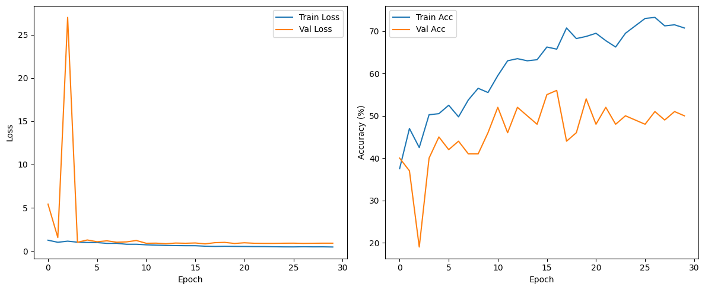

## 🧾 Document Forgery Detection

This repository contains a deep learning model that detects various types of **document forgeries** using a **multimodal architecture** combining:

* **ResNet-50** for visual feature extraction
* **LayoutLMv3** for layout and textual analysis

The model was trained on the **document forgery dataset** introduced in the paper:
🔗 [Document Forensics Using Visual Cues (arXiv:2408.01690v1)](https://arxiv.org/html/2408.01690v1#S3.T1)

---

## 📌 Forgery Classes Detected

This model classifies documents into the following categories:

1. `fraud1_copy_and_move`
2. `fraud2_face_morphing`
3. `fraud3_face_replacement`
4. `fraud4_combined`
5. `positive` (i.e., authentic)

---

## 🧠 Model Architecture

The model fuses two powerful backbones:

* **Visual Backbone**: ResNet-50 (pretrained on ImageNet)
* **Textual + Layout Backbone**: LayoutLMv3 (`microsoft/layoutlmv3-base`)

These are merged via a fusion MLP:

```python
nn.Sequential(
    nn.Linear(resnet_features + layoutlm_features, 512),
    nn.ReLU(),
    nn.Dropout(0.2),
    nn.Linear(512, num_classes)
)
```

---

## 📊 Results

The model was trained for 30 epochs. Below is the performance on the Nevada(US) dataset:

| Metric                  | Value                                                      |
| ----------------------- | ---------------------------------------------------------- |
| **Train Accuracy**      | \~72%                                                      |
| **Validation Accuracy** | \~50–55%                                                   |
| **Observation**         | Slight overfitting; validation performance plateaued early |



---

## 📁 Repository Structure

```bash
.
├── Document_Forgery_model.ipynb     # Full training pipeline
├── predict.ipynb                    # Inference script with LayoutLMv3 + ResNet
├── training_curves.png              # Visualization of training/validation metrics
```

---

## 📦 Requirements

Install necessary libraries with:

```bash
pip install torch torchvision transformers pillow numpy opencv-python pytesseract tqdm matplotlib seaborn scikit-learn
```

Also, install Tesseract OCR:

```bash
sudo apt-get install tesseract-ocr
```

> ⚠️ `pytesseract` is used for OCR to extract text and bounding boxes from document images.

---

## 🚀 Running the Project

### 🔧 1. Train the Model

Open the training notebook:

```bash
jupyter notebook "Document_Forgery_model.ipynb"
```

Modify paths to your dataset and train.

### 🔍 2. Run Inference

To predict forgery type on a single image:

```bash
jupyter notebook "predict.ipynb"
```

Key function:

```python
label, confidence = predict_document("path/to/image.jpg")
```

---

## 📚 Dataset

* **Name**: Nevada (US) Document Forgery Dataset
* **Source**: [arXiv paper](https://arxiv.org/html/2408.01690v1#S3.T1)
* **Note**: Dataset is not publicly shared in this repo. Refer to the paper for access instructions.

---

## 👨‍💻 Author

* **Name**: *Poras Ravindra Barhate*
* **GitHub**: https://github.com/Poras2005
* **email**: porasbarhate@gmail.com

---
